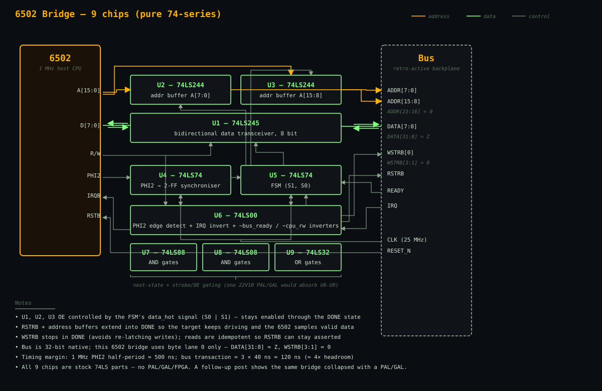

The [Architecture](/architecture/) page makes a claim that's easy to write and harder to back up:

> Each host connects through a small bridge — a handful of 74-series chips, a PAL/GAL, or a simple FPGA block — that translates the host's native cycles into bus transactions.

This project puts an honest number on it: a stock **MOS 6502 running at 1 MHz** on the draft Retro-Active bus, in two complete implementations — one that uses no programmable logic at all, and one that collapses most of the glue into a single 22V10. The full Verilog and cocotb harness are in the repo at [`bus-design/`](https://github.com/benpayne/retrocpu-web/tree/main/bus-design).

## What the 6502 actually needs

Before designing anything, it helps to remember how a 6502 talks to the outside world. The CPU is beautifully simple. Its bus cycle is one PHI2 period long — 1 μs at 1 MHz — and within that cycle:

- Address A[15:0] is valid shortly after the **PHI2 rising edge**
- R/W indicates direction (high = read, low = write)
- For **writes**, the 6502 drives D[7:0] during PHI2 high and holds it valid
- For **reads**, the 6502 samples D[7:0] just before the **PHI2 falling edge**

Everything the bridge has to do fits inside that one PHI2 period. It sees a cycle start, pushes the 6502's request onto the bus, waits for a reply, and hands the data back — all before PHI2 falls.

## The state machine

The bridge needs four states. The bus is synchronous to its own 25 MHz clock, not to PHI2, so we can't just wire up the 6502's pins and hope.

```text
        PHI2 rising        always            bus READY         PHI2 low
 IDLE ─────────────▶ DRIVE ──────────▶ WAIT ──────────▶ DONE ────────────▶ IDLE
```

- **IDLE** — waiting for a new 6502 cycle (PHI2 rising edge detected via a 2-FF synchroniser)
- **DRIVE** — put the address, R/W-derived strobes, and write data on the bus
- **WAIT** — keep driving; wait for the target to assert READY
- **DONE** — hold read data on the 6502's D[7:0] until PHI2 falls, so the CPU samples it cleanly

Two state bits S1, S0 encode the states using Gray-ish transitions. That fits in a single dual D flip-flop — or two of a 22V10's macrocells.

## Build A — pure 74-series (9 chips)

For builders who consider any programmable logic cheating, here's the all-discrete-TTL version:

| Ref | Part | Role |
|-----|------|------|
| U1 | 74LS245 | Bidirectional 8-bit data transceiver (6502 D0-D7 ↔ bus DATA[7:0]) |
| U2 | 74LS244 | Octal tristate buffer (6502 A0-A7 → bus ADDR[7:0]) |
| U3 | 74LS244 | Octal tristate buffer (6502 A8-A15 → bus ADDR[15:8]) |
| U4 | 74LS74 | Dual D flip-flop (PHI2 synchroniser, 2 FFs into the bus_clk domain) |
| U5 | 74LS74 | Dual D flip-flop (state machine: S1, S0) |
| U6 | 74LS00 | Quad NAND: PHI2 edge detect + IRQ inversion + spare gates as `~bus_ready` / `~cpu_rw` inverters |
| U7 | 74LS08 | Quad AND: 4 of 6 AND terms (next-state + strobe gating) |
| U8 | 74LS08 | Quad AND: remaining 2 AND terms |
| U9 | 74LS32 | Quad OR: all 4 OR terms (next-state + data-path enable) |

Beyond the five "fat" chips (data, two address buffers, two flip-flop pairs) and U6's NANDs, the bridge needs **12 combinational gates** of glue: next-state equations, the data-path-enable signal `data_hot = S0 | S1`, output-enable derivation, and WSTRB/RSTRB gating. U7-U9 hold those gates.

## The block diagram



Three signal families run through the bridge:

- **Address (amber)** — 6502 A[15:0] feeds through U2 and U3 onto the bus's lower 16 address bits. ADDR[23:16] is tied to zero.
- **Data (green)** — the 74LS245 handles both directions. On writes, A→B sends the 6502's value onto bus DATA[7:0]. On reads, B→A brings the target's reply back.
- **Control (grey)** — PHI2 feeds the synchroniser (U4), which drives the FSM (U5). U6 handles edge detection and IRQ inversion; U7/U8 hold the AND terms; U9 holds the OR terms.

## Two bugs the simulation caught

Writing the testbench first surfaced two real design bugs. Both would have cost a builder hours at the scope.

### Bug 1: read data disappeared before the 6502 could sample it

The original FSM had `cycle_active = S0`, true in DRIVE and WAIT but false in DONE. The 74LS245's OE was tied to that, so the moment the bus transaction completed and the FSM entered DONE, the 245 went tristate and the read data vanished from D[7:0] — before PHI2 had fallen. **Fix:** add a separate `data_hot = S0 | S1` signal and tie the 245's OE to that.

### Bug 2: the address went floating while the target was still listening

Once we extended the data path through DONE, we also extended **RSTRB** through DONE so the target would keep driving. (WSTRB was *not* extended — re-asserted writes corrupt FIFOs and write-to-clear registers.) But RSTRB stayed high while the address buffers still used the old `cycle_active` for OE — so the moment we hit DONE, the address went tristate, the target read `mem[X]`, and the read register got corrupted with X. **Fix:** drive the address buffers from `data_hot` too.

## Build B — with a 22V10 (4 chips)

Now allow ourselves a single 22V10 PAL/GAL — the standard "1980s glue absorber" part. It has 10 macrocells, each registered or combinational, with 12 dedicated inputs plus 10 I/O pins.

| Ref | Part | Role |
|-----|------|------|
| U1 | 74LS245 | 8-bit data transceiver (unchanged) |
| U2 | 74LS244 | Address buffer A[7:0] (unchanged) |
| U3 | 74LS244 | Address buffer A[15:8] (unchanged) |
| U4 | 22V10 | All FSM + sync + strobes + OEs + IRQ inv (absorbs old U4-U9) |

**Macrocell allocation** (8 of 10 used):

| Cell | Type | Function |
|------|------|----------|
| M1 | registered | `phi2_sync0` (D = `cpu_phi2`) |
| M2 | registered | `phi2_sync1` (D = `phi2_sync0`) |
| M3 | registered | `S0` |
| M4 | registered | `S1` |
| M5 | combinational | `oe_n` = `~(S0 \| S1)` — drives U1, U2, U3 OE_n |
| M6 | combinational | `bus_wstrb_0` = `S0 & ~cpu_rw` |
| M7 | combinational | `bus_rstrb` = `(S0 \| S1) & cpu_rw` |
| M8 | combinational | `cpu_irq_n` = `~bus_irq` |

Two macrocells spare. The 245 and 244s stay because the PAL only has 10 outputs — not enough to drive the 16-bit address bus on its own.

The collapse: U4-U9 (six chips) become one 22V10, dropping the chip count from 9 to 4. That's roughly a 55% reduction with no behaviour change.

## Test results

The same cocotb suite runs against both builds. Five tests against a fake memory target:

```text
test_reset_clean              PASS    380 ns
test_single_write_then_read   PASS   2480 ns
test_multiple_addresses       PASS  15080 ns
test_irq_passthrough          PASS    680 ns
test_back_to_back_cycles      PASS  33980 ns
TESTS=5 PASS=5 FAIL=0
```

Both builds run the suite in well under a second on iverilog.

## Multi-slot

The 6502's 16-bit address space maps onto a single backplane slot.  In a multi-host system the 6502's `BUS_ADDR_BANK` parameter sets which slot the bridge owns — `0x40` means slot 0, `0x41` slot 1, …, `0x4F` slot 15.  Inside that slot the 6502 sees the full 64 KB register window.

A separate test build (`make TARGET=6502_multislot`) exercises this:

- The 6502 PAL bridge is parameterized with `BUS_ADDR_BANK = 0x40` (slot 0)
- A small backplane decoder (one `74LS154` + comparator) generates per-slot `SLOT_SEL_n` from `ADDR[19:16]`
- Two cards are instantiated: card A at slot 0 (where the 6502 talks), card B at slot 5 (which the 6502 *cannot* reach)

Three tests verify the slot model:

```text
test_6502_writes_dont_reach_slot5   PASS  34020 ns   (32 writes from 6502; slot-5 card untouched)
test_6502_writes_land_in_slot0      PASS   4620 ns   (6502 writes appear in slot-0 card's memory)
test_6502_round_trip_slot0          PASS   2480 ns   (write through 6502, read through 6502)
TESTS=3 PASS=3 FAIL=0
```

That's the per-host story for the 6502: one bridge, one slot, but the rest of the backplane stays available to other hosts (e.g. a 68k on its own bridge) without contention.

## Timing margin

- 6502 PHI2 half-period at 1 MHz: **500 ns**
- Bus transaction (DRIVE → WAIT → DONE): **3 bus cycles × 40 ns = 120 ns**
- Margin: about **4× headroom** inside one PHI2 high period

A WDC65C02 at 4 MHz still fits. At 14 MHz the transaction time approaches the PHI2 half-period and you'd want to insert wait-states via the 6502's RDY input.

## What this proves

Both builds satisfy the Architecture page's claim — "a handful of 74-series chips, a PAL/GAL, or a simple FPGA block":

- **Pure 74-series**: 9 chips, all stock LS parts, every gate accounted for
- **With a 22V10**: 4 chips, same behaviour, ~half the package count
- Same cocotb suite passes against either implementation

A builder who avoids any programmable logic gets the 9-chip path. A builder who's happy with one PAL gets the 4-chip path. The bus-side behaviour is bit-for-bit identical, so cards work the same on either build.

## What this does *not* prove

- **Physical timing** — Verilog uses zero-delay behavioural models. A real board needs timing analysis with actual LS/HC/AC propagation delays and bus capacitance.
- **Electrical** — no analysis of fanout, bus termination, or level-shifting.
- **Wait states** — the NMOS 6502's RDY input only works during reads. Our bridge completes within one PHI2 half-cycle at 1 MHz; faster CPUs or slower targets would need wait-state logic.

These are the questions Phase 2 of the [standardization roadmap](/architecture/) asks: *what breaks on a 6502 bridge? What does a 74-logic bridge need that an FPGA bridge doesn't?* This project is the first data point.

## Try it yourself

The full design lives in the repository under `bus-design/`:

```bash
cd bus-design/test
source ../../.venv/bin/activate
make TARGET=6502             # 9-chip pure-74 build, single card
make TARGET=6502_pal         # 4-chip PAL/GAL build, single card
make TARGET=6502_multislot   # PAL build + backplane + card at slot 0 + quiet card at slot 5
```

Single-card builds report `TESTS=5 PASS=5 FAIL=0`; the multi-slot build reports `TESTS=3 PASS=3 FAIL=0`. All three complete in well under a second.
