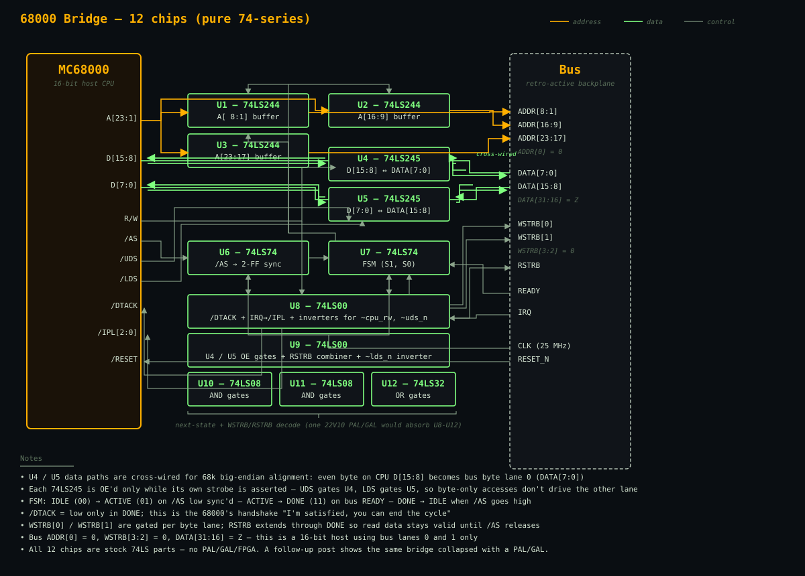

The [6502 bridge](/projects/6502-bridge/) put numbers on the simplest case: 9 chips pure-74, 4 chips with a 22V10. This project does the same for the bigger, richer cousin: the **Motorola 68000**, running its async bus cycle with /AS, /UDS, /LDS, and /DTACK.

The 68000 is the CPU I always wanted to build around as a kid. It runs free operating systems (EmuTOS, Linux-68k), has a clean instruction set, and sits right in the sweet spot between 8-bit simplicity and 32-bit power. If the bus can't support a 68k machine in pure 74-series, we don't really have an ecosystem.

It can. **12 chips pure-74, 6 with a PAL.**

## The 68000 in a paragraph

Where a 6502 clocks its bus on PHI2, the 68000 does it in an asynchronous handshake:

- CPU drives address on **A1-A23** (no A0 pin; byte selection is via the strobes)
- CPU drives R/W
- CPU asserts **/AS** (Address Strobe) — tells the world "a cycle has started"
- CPU asserts **/UDS** and/or **/LDS** — Upper and Lower Data Strobe; which byte lanes are live
- For writes, CPU drives data on D0-D15
- Slave responds by asserting **/DTACK** (Data Transfer Acknowledge)
- CPU sees /DTACK, samples data (for reads), releases /AS, /UDS, /LDS
- Slave releases /DTACK

No strict clock window, no "sample before PHI2 falls." The CPU waits for the slave. That's simpler in one sense — you can't miss the sample window — and trickier in another: the slave is now contractually obligated to pull /DTACK low to complete the cycle.

## The big-endian wrinkle

The 68000 is big-endian, and that surfaces on the bus in a specific way:

- A byte access to an **even** address uses **/UDS**, and the data lives on **D[15:8]** (the "upper" half)
- A byte access to an **odd** address uses **/LDS**, and the data lives on **D[7:0]** (the "lower" half)
- A word access to an even-aligned address uses both strobes, with the byte-at-the-even-address on D[15:8] and the byte-at-the-odd-address on D[7:0]

The Retro-Active bus, meanwhile, is byte-lane indexed by **address offset**: `WSTRB[0]` is "the byte at ADDR+0", `WSTRB[1]` is "the byte at ADDR+1", and so on.

Line those up and you get a cross-wire:

```text
   bus DATA[ 7:0]   ↔   68k D[15:8]     (UDS, even byte, WSTRB[0])
   bus DATA[15:8]   ↔   68k D[ 7:0]     (LDS, odd  byte, WSTRB[1])
```

That cross-wiring is a *feature* of the bridge, not an accident. It's the concrete evidence that the bus stays CPU-agnostic: anything that does byte-lane addressing on its own side can line up with the bus's lane mapping by swapping pins where it crosses the bridge.

## The state machine

Because the 68000's cycle is async, the bridge FSM is actually *simpler* than the 6502 one:

```text
           /AS low (synced)         bus_ready            /AS high
  IDLE ─────────────────────▶ ACTIVE ───────────▶ DONE ─────────────▶ IDLE
                                (drive bus)    (/DTACK low back to CPU)
```

Three states, 2 bits. /DTACK is a pure combinational function of state (low in DONE). Once the CPU sees /DTACK, it deasserts /AS, which tells us the cycle is over and we return to IDLE.

## Build A — pure 74-series (12 chips)

| Ref | Part | Role |
|-----|------|------|
| U1 | 74LS244 | Address buffer A1-A8 → bus ADDR[8:1] |
| U2 | 74LS244 | Address buffer A9-A16 → bus ADDR[16:9] |
| U3 | 74LS244 | Address buffer A17-A23 → bus ADDR[23:17] (7 bits used) |
| U4 | 74LS245 | 68k D[15:8] ↔ bus DATA[7:0] (UDS byte lane, cross-wired) |
| U5 | 74LS245 | 68k D[7:0] ↔ bus DATA[15:8] (LDS byte lane, cross-wired) |
| U6 | 74LS74 | /AS synchroniser (2 FFs into bus_clk domain) |
| U7 | 74LS74 | FSM state (S1, S0) |
| U8 | 74LS00 | Quad NAND: /DTACK + IRQ→IPL inverter + `~cpu_rw`, `~uds_n` inverters |
| U9 | 74LS00 | Quad NAND: U4/U5 OE gates + RSTRB OR combiner + `~lds_n` inverter |
| U10 | 74LS08 | Quad AND: state-machine terms |
| U11 | 74LS08 | Quad AND: strobe terms (in_active·~RW, WSTRB[0], WSTRB[1]) |
| U12 | 74LS32 | Quad OR: next-state OR gates |

12 chips, all stock LS. The five "fat" chips (3 address buffers + 2 data transceivers) are unavoidable. Everything else (U6-U12) is the FSM and combinational glue.

## The block diagram



Three families of wires, colour-coded the same way as the 6502 diagram:

- **Amber — address.** Three 74LS244 banks buffer the 23 address lines onto bus ADDR[23:1]; bus ADDR[0] is tied to 0 (the 68000 has no A0 pin).
- **Green — data.** Two 74LS245s, cross-wired as described above. Each 245 is OE'd only while its own byte strobe is asserted, so the bridge doesn't drive a lane the CPU isn't asking for.
- **Grey — control.** /AS feeds a 2-FF synchroniser (U6). The FSM (U7) tracks IDLE/ACTIVE/DONE. U8/U9 provide /DTACK, the IPL inverter, and the NAND-based OE/strobe combiners. U10–U12 hold the remaining AND and OR terms.

## Build B — with a 22V10 (6 chips)

Same target, single PAL absorbing all the FSM and combinational glue:

| Ref | Part | Role |
|-----|------|------|
| U1 | 74LS244 | Address A[8:1] (unchanged) |
| U2 | 74LS244 | Address A[16:9] (unchanged) |
| U3 | 74LS244 | Address A[23:17] (unchanged) |
| U4 | 74LS245 | UDS lane data (unchanged) |
| U5 | 74LS245 | LDS lane data (unchanged) |
| U6 | 22V10 | All FSM + sync + /DTACK + strobes + 245 OEs (absorbs old U6-U12) |

**Macrocell allocation** (10 of 10 used — exact fit):

| Cell | Type | Function |
|------|------|----------|
| M1 | registered | `as_n_sync0` |
| M2 | registered | `as_n_sync1` |
| M3 | registered | `S0` |
| M4 | registered | `S1` |
| M5 | combinational | `cpu_dtack_n` = `~(S1 & S0)` |
| M6 | combinational | `bus_wstrb_0` = `in_active & ~cpu_rw & ~cpu_uds_n` |
| M7 | combinational | `bus_wstrb_1` = `in_active & ~cpu_rw & ~cpu_lds_n` |
| M8 | combinational | `bus_rstrb` = `cycle_active & cpu_rw & (~uds_n \| ~lds_n)` |
| M9 | combinational | `u4_oe_n` = `~(cycle_active & ~cpu_uds_n)` |
| M10 | combinational | `u5_oe_n` = `~(cycle_active & ~cpu_lds_n)` |

Tight — 22V10 is exactly the right size. If you want headroom, a 26V12 (12 macrocells) gives you slack.

**Important note on /IPL**: in this PAL build the 68000's /IPL[2:0] interrupt input is generated by the **host-side interrupt controller** (see the [backplane reference](https://github.com/benpayne/retrocpu-web/blob/main/bus-design/docs/backplane.md)), not by the bridge. That separation is what keeps the bridge fitting in one 22V10. If you instead want IRQ inversion in the bridge for parity with the pure-74 build, add one 74LS04 hex inverter — that's a 7-chip variant.

The collapse: U6-U12 (seven chips) become one 22V10, dropping the chip count from 12 to 6. That's a **50% reduction**.

## Test results

Seven cocotb tests exercise the bridge against a 16-bit fake memory target. The PAL build runs the same suite minus `test_irq_passthrough` (since the PAL bridge has no IRQ pins — that's the interrupt controller's job).

```text
[pure-74 build]
test_reset_clean            PASS   360 ns
test_byte_write_read_even   PASS  1050 ns     (UDS,  even-byte path)
test_byte_write_read_odd    PASS  1050 ns     (LDS,  odd-byte  path)
test_word_write_read        PASS  1050 ns     (both strobes together)
test_byte_pair_alignment    PASS  1370 ns     (even+odd writes rejoin as a word)
test_multiple_addresses     PASS  4890 ns
test_irq_passthrough        PASS   700 ns
TESTS=7 PASS=7 FAIL=0

[PAL build]
(same 6 tests above, IRQ test skipped)
TESTS=6 PASS=6 FAIL=0
```

The `byte_pair_alignment` test is the one that actually validates the cross-wiring. It writes 0xAB as a byte to address 0x3000 (even, UDS path) and 0xCD to address 0x3001 (odd, LDS path), then reads a 16-bit word at 0x3000. The expected result is 0xABCD — which only happens if the even byte ended up in the CPU's high half and the odd byte in the low half. It does. The cross-wired 245s carry their weight in both builds.

## Multi-slot

The 68000's full 23-bit address bus passes straight through the bridge to the bus. A 68k system that puts its IO at `0x400000-0x4FFFFF` lands automatically on the right slot — `ADDR[19:16]` selects which one, no extra hardware on the host side.

A separate test build (`make TARGET=68k_multislot`) exercises the full slot model:

- The 68k PAL bridge talks to a small backplane decoder (one `74LS154` + a 4-bit comparator + a strobe-OR), which generates 16 active-low `SLOT_SEL_n` lines from `ADDR[19:16]`
- Two cards are instantiated: card A at slot 3 (`0x430000`), card B at slot 7 (`0x470000`)
- The fake targets gate their internal cycle handling on `SLOT_SEL_n`

Five tests prove slot isolation:

```text
test_isolation_byte                       PASS  4390 ns   (write to slot 3, slot 7 untouched)
test_isolation_word                       PASS  4390 ns   (word writes; both byte lanes per slot)
test_same_offset_different_slots          PASS  4390 ns   (no card alias on shared offsets)
test_unpopulated_slot_does_not_dtack      PASS  3560 ns   (writes to slot 0 hang waiting for /DTACK)
test_address_outside_io_region_does_not_dtack   PASS  2560 ns
TESTS=5 PASS=5 FAIL=0
```

The last two are the "negative" tests that prove the backplane decoder is doing its job: a cycle to a slot with no card, or to an address outside the IO region (`ADDR[23:20] != 0x4`), correctly fails to assert `/DTACK` and leaves the CPU waiting until it gives up.

> **Footnote:** building the multi-slot test surfaced a real, pre-existing bug in the 68k bridge's address-buffer wiring (the high `74LS244` was double-driving `bus_addr[20]`). Single-card tests had been silently masking it — every test address kept that bit zero on both drivers. The multi-slot tests, by hitting `0x430000`, were the first to set those bits differently. Fix landed alongside the multi-slot work; both pure-74 and PAL builds incorporate it.

## What was surprising

After writing the 6502 bridge, I expected the 68000 version to be noticeably harder. It wasn't, and the reasons are worth calling out:

- **Async beats synchronous.** The 6502 bridge had to do edge detection on PHI2, extend its strobes through a DONE state, and hold the 74LS245 open until PHI2 fell. The 68000 version just watches /AS, sets /DTACK, and waits for /AS to release. One signal, three states, done. If I were designing a retro bus from scratch today, I'd pick async handshake over clocked timing — it's genuinely simpler.

- **Byte-lane decoding is almost free if you cross-wire.** The cross-wiring is just PCB traces; the bridge doesn't even have to think about endianness. It's done in copper.

- **/IPL fits in the interrupt controller, not the bridge.** That's why the PAL build hits exactly 10 macrocells without spilling. The cleanest split is: bridge handles cycles; interrupt controller handles aggregation.

## What's still open

- **Real electrical** — zero-delay behavioural sim doesn't check setup/hold on real LS parts, bus loading, or ground bounce. A bench build needs a scope pass.
- **Bus error / abort** — the 68000 has a /BERR input for "this slave didn't answer in time." Not implemented. A real bridge should raise /BERR if bus_ready never comes.
- **FC0-FC2 function codes** — ignored. They matter for supervisor/user mode distinction and interrupt acknowledge cycles.
- **Read-Modify-Write cycles** (TAS instruction) — the 68000 can hold /AS through an RMW. Bridge would need to stay in ACTIVE across multiple bus transactions for this. Not tested.

These don't change the BOM. They're incremental features.

## The two bridges side by side

| | 6502 bridge | 68000 bridge |
|---|---|---|
| Pure 74-series chip count | 9 | 12 |
| With one 22V10 PAL/GAL | 4 | 6 |
| CPU data width | 8 bit | 16 bit (two 8-bit lanes) |
| CPU address width | 16 bit | 23 bit |
| Bus cycle style | synchronous (PHI2) | asynchronous (/AS + /DTACK) |
| FSM states | 4 (IDLE/DRIVE/WAIT/DONE) | 3 (IDLE/ACTIVE/DONE) |
| Trickiest bit | data hold through DONE | byte-lane cross-wiring |
| Single-card tests | 5 PASS | 7 / 6 PASS (pure-74 / PAL) |
| Multi-card tests | 3 PASS (slot 0 + quiet card at slot 5) | 5 PASS (cards at slots 3 and 7) |

Both bridges fit comfortably in what any hobbyist would call "a handful of chips," whether or not you allow programmable logic.

## Try it yourself

The full design lives in the repository under `bus-design/`:

```bash
cd bus-design/test
source ../../.venv/bin/activate
make TARGET=68k              # 12-chip pure-74 build, single card
make TARGET=68k_pal          # 6-chip PAL/GAL build, single card
make TARGET=68k_multislot    # PAL build + backplane + 2 cards at slots 3 & 7
```

If you're a Z80 or 8088 builder, your bridge is probably somewhere between these two. If you've built one, or are thinking about building one: tell us what broke.
